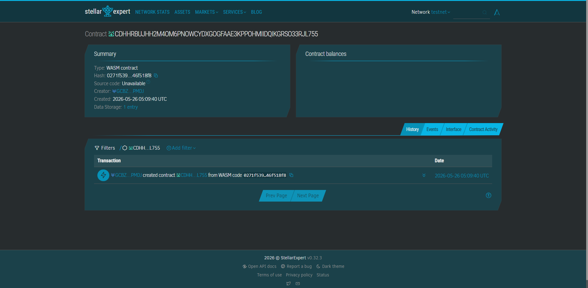

# TalinoSave 🔄
> On-chain paluwagan / arisan — a trustless rotating savings circle for SEA student study groups.

---

## Problem
Five computer science students in Bandung run an informal *arisan* (rotating savings club) via WhatsApp to fund each other's laptop or textbook purchases. Every semester, the "treasurer" disappears with the pot before their round ends — destroying trust and leaving members out of pocket with no recourse.

## Solution
TalinoSave puts the rotating savings circle logic inside a Soroban smart contract. Members are registered at initialization; each round, every member contributes a fixed XLM amount, and the designated recipient for that round claims the pooled pot — enforced on-chain with no human treasurer required. Transparent, automatic, trustless.

---

## Stellar Features Used
- ✅ **XLM transfers** — contribution and payout denomination
- ✅ **Soroban smart contracts** — rotation logic, contribution tracking, pot release
- ✅ **Trustlines** — future USDC stable coin circle support

---

## Target Users
- **Primary:** Groups of 3–8 university students in Indonesia, Philippines, Malaysia — aged 18–26 — running informal savings circles (paluwagan, arisan, hui)
- **Secondary:** Student organizations managing pooled funds for shared equipment or events

---

## Core Feature (MVP)
1. **Admin** calls `initialize(members, contribution)` → circle created with ordered payout list
2. **Each member** calls `contribute()` → XLM deposited to round pool; tracked per member per round
3. **Round recipient** calls `claim_pot()` → receives all contributions (N × contribution amount); circle advances to next round

Demo flow: 3 wallets contribute → wallet #1 claims 30 XLM pot → circle advances → wallet #2 becomes next recipient.

---

## Why This Wins
Rotating savings circles are used by hundreds of millions of people across SEA — but they break down on trust. TalinoSave replaces the treasurer with Soroban logic. Judges see a real cultural financial practice being made trustless for the first time, with zero bank involvement.

---

## Optional Edge
**QR-based mobile contribution** — each member scans a QR code that deep-links to a mobile wallet (Freighter/Lobstr) with the `contribute()` transaction pre-filled, making the UX as simple as a WeChat Pay tap.

---

## Vision & Purpose
"Talino" means intelligence or wisdom in Filipino. TalinoSave brings the wisdom of community savings into the trustless on-chain world — preserving the culture while removing the single point of failure.

---

## Prerequisites
- Rust `1.74+`
- Soroban CLI `21.x` — `cargo install --locked soroban-cli`
- Stellar Testnet funded accounts (one per circle member)

---

## Build
```bash
soroban contract build
# Output: target/wasm32-unknown-unknown/release/talino_save.wasm
```

## Test
```bash
cargo test
```

## Deploy to Testnet
```bash
soroban contract deploy \
  --wasm target/wasm32-unknown-unknown/release/talino_save.wasm \
  --source <ADMIN_SECRET_KEY> \
  --network testnet
```

## Initialize Circle (3 members, 10 XLM each)
```bash
soroban contract invoke \
  --id <CONTRACT_ID> \
  --source <ADMIN_SECRET_KEY> \
  --network testnet \
  -- initialize \
  --admin <ADMIN_ADDRESS> \
  --members '["<MEMBER_A_ADDRESS>","<MEMBER_B_ADDRESS>","<MEMBER_C_ADDRESS>"]' \
  --contribution 100000000
```

## Member Contributes to Current Round
```bash
soroban contract invoke \
  --id <CONTRACT_ID> \
  --source <MEMBER_A_SECRET_KEY> \
  --network testnet \
  -- contribute \
  --member <MEMBER_A_ADDRESS>
```

## Check Next Recipient
```bash
soroban contract invoke \
  --id <CONTRACT_ID> \
  --network testnet \
  -- next_recipient
```

## Claim Pot (must be called by the round's designated recipient)
```bash
soroban contract invoke \
  --id <CONTRACT_ID> \
  --source <MEMBER_A_SECRET_KEY> \
  --network testnet \
  -- claim_pot \
  --claimant <MEMBER_A_ADDRESS>
```

## Deployment 
CONTRACT ID: CDHHRBUJHH2M4OM6PNOWCYDXGOGFAAE3KPPOHMIIDQIKGRSO33RJL755



---

## License
MIT
